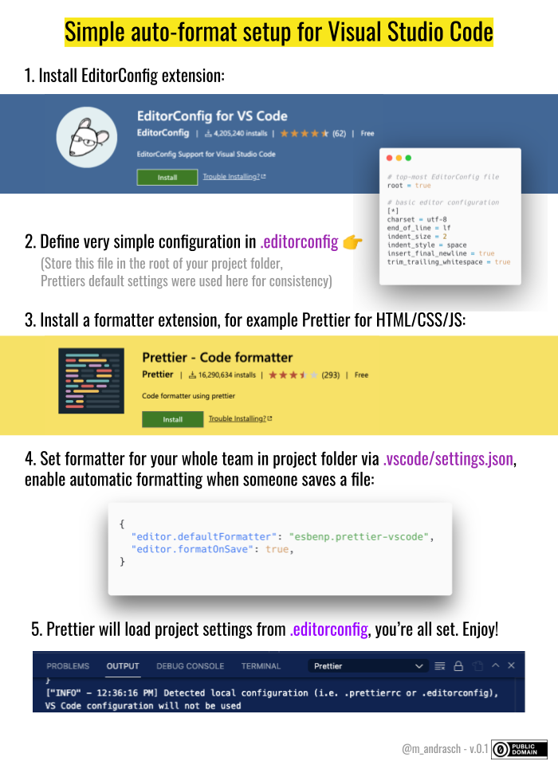
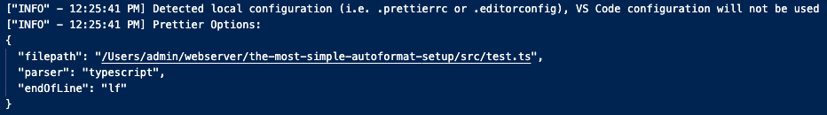

# Auto-Formatting in shared projects

_State: Work in progress_


Source: [GDocs](https://kurzelinks.de/9i7r)

## Full guide

How to start easily with Auto-Formatting in shared team projects in VSCode?

First of all, the auto format shortcut in Visual Studio Code is the following:

- Windows: `Shift + Alt + F`
- Mac: `Shift + Option + F`
- Linux: `Ctrl + Shift + I`

or `Right click -> Format`.

⚠️ BUT: The result of auto-formatting depends on your vscode settings as well as the used formatter (extension). Therefore a shared configuration for your team is needed, otherwise everyone will apply a different formatting and git history chaos ensues. ;-)

**What's my current formatter?**

You can find out which formatter is currently used by `Right click -> Format Document with ...`)


Another helpful information can be found in the status bar, this is a core feature of VSCode: The currently used tab / space settings in the file as detected by VSCode, the charset, the line ending of the file as well as the currently detected language:


## How to use the same setting in teams?

The most simple way I found is using a combination of `.editorconfig` and `.vscode/settings.json`.

⚠️ For editorconfig-support the [EditorcConfig-extension](https://marketplace.visualstudio.com/items?itemName=EditorConfig.EditorConfig) needs to be installed. If you open up a project folder, .editorconfig and .vscode/settings.json will then be parsed (it's called VSCode workspace).

### Separation of concerns

Why two config files? I followed this argument:

- All configuration related to the editor (end of line, indent style, indent size...) should be handled by EditorConfig
- Everything related to code formatting should be handled by [a Formatter extension such as] Prettier

Source: [theodo.com - Set up ESlint, Prettier & EditorConfig without conflicts](https://blog.theodo.com/2019/08/empower-your-dev-environment-with-eslint-prettier-and-editorconfig-with-no-conflicts/). The article also refers to "The rest (code quality) should be handled by ESLint" as well, but we'll skip this in order to keep it simple.

### Configuration

Prettier was built as "opinionated code formatter" with the goal of "No need to discuss style in code review".

But Prettier does not support every filetype, therefore we store our basic configuration in .editorconfig in the first step:

**1. Line endings, tab width, UTF-8**

Line endings and encoding UTF-8 for all files are defined in [.editorconfig](./.editorconfig). This is important for git commits, different team members using different line endings can be annoying in git history. Another advantage of .editorconfig i sthat other IDEs and other file type formatters can parse these basic settings as well. This is consistent with prettiers defaults of tab-width:2:

```bash
# EditorConfig is awesome: https://EditorConfig.org

# top-most EditorConfig file
root = true

# basic editor configuration, consistent to prettier defaults
# https://prettier.io/docs/en/options.html
[*]
end_of_line = lf
insert_final_newline = true
charset = utf-8
indent_size = 2
indent_style = space
```

**2. Set default formatter(s)**

The important part is to set a defaultFormatter for your team such as [Prettier](https://prettier.io/) for HTML/CSS/JS in [.vscode/settings.json](./.vscode/settings.json):

```json
{
  "editor.defaultFormatter": "esbenp.prettier-vscode",
  "editor.formatOnSave": true
}
```

As mentioned above we just use prettier defaults by using an empty [.prettierrc](./.prettierrc) file. Prettier default is for example tab width = 2, see [Prettier options](https://prettier.io/docs/en/options.html).

```json
{}
```

This has the advantage that global settings of your vs code configuration won't be used in this project, e.g. if someone set their tab width to 3 in VSCode > Preferences > Prettier. This will be ignored:



Optional: Exclude file types if you need a different formatter for PHP, Nunjucks, etc. (Formatters behave differently, some respect and parse .editorconfig). Here is an example for choosing a different formatter for PHP:

```json
"[php]": {
    "editor.defaultFormatter": "bmewburn.vscode-intelephense-client"
}
```

### 3. formatOnSave = true?

The best settings doesn't help much if you forget to format the file before you commit it. Therefore we enable formatting on save in `.vscode/settings.json` already.

If you don't want to use formatOnSave=true for all file types, you can exclude them (or just activate it for specific filetypes):

```json
"[scss]": {
        "editor.formatOnSave": true
}
```

_Unfortunately you can't currently configure multiple languages at once like [scss, js], see [vscode/issues/51935](https://github.com/microsoft/vscode/issues/51935)._

If you want to let decide each team member when to use formatOnSave, you can use [Status Bar Format Toggle extension](https://marketplace.visualstudio.com/items?itemName=tombonnike.vscode-status-bar-format-toggle) as well and set `formatOnSave`to `false`.

### Extensions needed

- Parse .editorconfig: [EditorConfig](https://marketplace.visualstudio.com/items?itemName=EditorConfig.EditorConfig)-extension
- Formatter, e.g. [Prettier](https://marketplace.visualstudio.com/items?itemName=esbenp.prettier-vscode)-extension

_Recommended extensions can be documented in [.vscode/extensions.json](./.vscode/extensions.json)_

### Challenges:

- While Prettier supports many file types, there are always exceptions such as Nunjucks (used by eleventy e.g.) or languages such as PHP (only via prettier plugin), etc.
- In some combinations file associations need to be used, e.g. when Nunjucks syntax is used in .html-files.
- Don't get confused by status bar "Spaces: X" information, this information can be wrong if there are no spaces used in empty files. After first format and re-opening the file this will be detected correctly by VSCode.

### TODOs

- What about `insert_final_newline = true`, not supported by prettier, what is the default of prettier? (https://prettier.io/docs/en/api.html#prettierresolveconfigfilepath--options)
- Do we really need an empty .prettierrc file? .editorconfig should be enough to use (local) project folder settings (and not user-specific vscode settings)?

### More resources:

- https://blog.theodo.com/2019/08/empower-your-dev-environment-with-eslint-prettier-and-editorconfig-with-no-conflicts/
- (german) https://bitspeicher.blog/make-it-prettier-teil-1-was-ist-prettier-und-warum-sollte-ich-es-verwenden/
- https://prettier.io/docs/en/option-philosophy.html
- Prettier: .prettierrc > .editorconfig > vscode settings https://prettier.io/docs/en/api.html#prettierresolveconfigfilepath--options
- Other strategies:
  - https://twitter.com/fn_schubert/status/1455810034374426624
  - https://twitter.com/kino_auge/status/1455814661526409220
